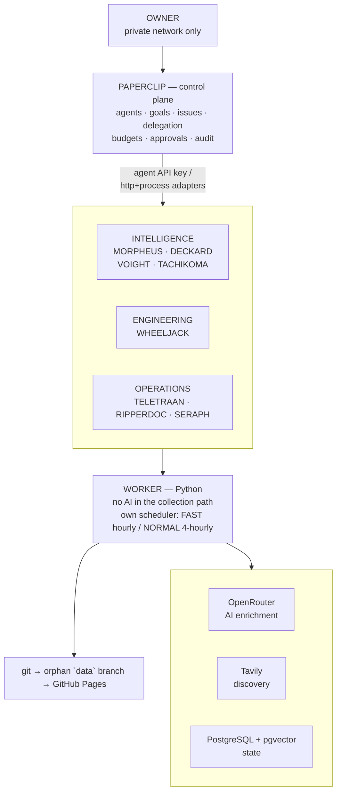
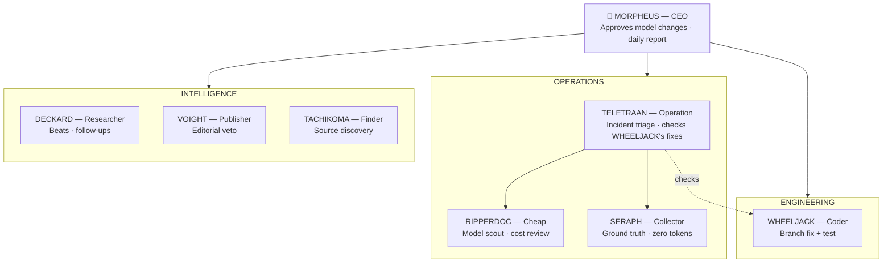

# CyberPulse-AI

**An autonomous Australia-first cyber security + AI intelligence organisation**

`COLLECT → NORMALISE → CORRELATE → VERIFY → ENRICH → SCORE → PUBLISH → MONITOR → SELF-HEAL`

**[Live site →](https://happycode0.github.io/CyberPulse-AI/)**

---

## What this is

Not a news aggregator. A small, permanently-running intelligence organisation staffed by eight
named agents who each own a job.

Deterministic Python collects from dozens of live-validated sources on three cadences and
resolves many reports into **one canonical event**. Ground truth comes from CISA KEV, CVE.org,
CISA Vulnrichment, EPSS, OSV and MITRE ATT&CK — never from a model's memory. AI is an enrichment
layer that judges severity, extracts entities, reasons about Australian relevance and reconciles
conflicting evidence, always from retrieved facts, never recalled from training data.

[Paperclip](https://github.com/paperclipai/paperclip) is the control plane where the agents
live, wake, delegate and spend budget. When a source breaks, the watchdog opens an incident, an
engineer agent fixes the parser on a branch, an independent auditor checks it on a different
model, and a human approves the merge.

The public site is a static HUD on GitHub Pages that publishes only canonical, evidence-linked
intelligence — and says plainly that it's a snapshot of the last completed run, not a live feed.

---

## Architecture

| | |
|---|---|
| **Control plane** | Paperclip — agents, issues, delegation, budgets, approvals, audit |
| **Deterministic layer** | Python worker — collection, resolution, scoring, publishing, scheduling |
| **Inference** | OpenRouter, free tier first, then two paid tiers. Hard monthly cap, output price ceiling enforced in code |
| **Discovery** | Tavily, free tier |
| **State** | PostgreSQL + pgvector |
| **Public site** | Static HTML/CSS/JS on GitHub Pages — no build step, no secrets |

The worker is intentionally the only thing in the collection path with no AI: it keeps
collecting, scoring and publishing on its own schedule even if Paperclip and every agent are
stopped. Agents add judgment on top — Australian relevance, campaign links, follow-ups, quality
review — never ground truth.

---

## The crew

Personas are presentation, not authority — that comes from each agent's Paperclip role,
permissions and budget. Deterministic agents cost zero tokens, which is the whole point of the
split.

| Callsign | Job | Beat | Runtime |
|---|---|---|---|
| **MORPHEUS** · *"I can only show you the door."* | CEO | Chief editor; approves model changes | LLM |
| **DECKARD** · *"The case stays open until it's patched."* | Researcher | Australian, global and AI beats; follow-up on developing events | LLM |
| **VOIGHT** · *"Says who?"* | Publisher | Editorial QA, publication veto | LLM |
| **TACHIKOMA** · *"Ooh — what's this one?"* | Finder | Source discovery | LLM + Tavily |
| **WHEELJACK** | Coder | Source & platform engineer, branch + PR only | LLM |
| **TELETRAAN** | Operation | Incidents, self-healing, independent check on every fix (a different model vendor from WHEELJACK) | Deterministic + LLM |
| **RIPPERDOC** · *"Better chrome just came in."* | Cheap | Model scout (cheapest capable model, free where possible) and the monthly cost review | Deterministic + LLM |
| **SERAPH** · *"I had to be sure."* | Collector | Ground truth, the source gate, correlation and publishing | Deterministic, zero tokens |

See [how the crew works together](docs/wiki/stage-4c-how-the-crew-works.md) for how work moves
between them, and [the crew](docs/wiki/stage-4b-the-crew.md) for each agent's full configuration.

MORPHEUS sits at the top as CEO and reports to no one but the owner: it decides what the crew
covers, writes the daily intelligence report, and signs off on every model change. Below that,
three small departments split the work. **Operations** (TELETRAAN, RIPPERDOC, SERAPH) keeps the
lights on — incident triage, model cost control, and the zero-token collection pipeline that runs
whether or not any agent is awake. **Intelligence** (DECKARD, VOIGHT, TACHIKOMA) does the editorial
work — research, publication veto, source discovery. **Engineering** (WHEELJACK) fixes broken
parsers on a branch and hands the diff to TELETRAAN, which checks it on a different model vendor
before a human merges. Each box only has the budget and credentials its job needs — nobody can
approve their own change.

### Org chart

---

## Cost control

The hard stop is the OpenRouter key's own monthly limit — the platform cannot exceed it
regardless of any bug on this side. Inside that, the worker degrades progressively:

| Budget remaining | Behaviour |
|---|---|
| > 50% | Full model ladder: free tier → cheap → strong, by task |
| 20–50% | Strong tier restricted to critical and known-exploited events |
| < 20% | Free tier only, and only critical / high / known-exploited / developing |
| Free daily cap hit | Falls through to the cheap paid tier |
| Exhausted | Paid AI off; free tier and deterministic collection continue |

## Secret hygiene

Non-negotiable, and enforced in code:

- Secrets live only in an untracked `.env`, never committed, logged or pasted anywhere
- Each agent gets only the credentials its job requires
- The engineer agent holds exactly one credential: a branch-scoped GitHub token
- The publisher secret-scans every payload before publishing and **fails closed**
- Ingested article text is treated as untrusted input, given to models as data with no tools
  available, and never forwarded to the engineer agent

See the [threat model](docs/threat-model.md) for the full analysis, open risks and what's done
about each.

---

## Work in progress

CyberPulse-AI runs for real every day, but it's still actively evolving — stated plainly, because
an intelligence product that oversells itself is worthless:

- **The public site is not live yet.** It shows the last completed collection run, labelled with
  its timestamp. The FAST lane (critical and time-sensitive feeds) collects and publishes hourly;
  the NORMAL lane (everything else) every 4 hours — across roughly 70 sources, with the live count
  and each one's health on the site's own [Sources](https://happycode0.github.io/CyberPulse-AI/index.html?view=sources) page.
  True live updates are on the roadmap.
- **AI severity and MITRE mappings are labelled as AI-suggested**, not official attribution, while
  the scoring prompts keep being tuned. CVSS, KEV status and CVE facts always come from
  authoritative sources, or are recorded as `unknown`.
- **Missing data is `unknown`, never "low"** — a deliberate choice, not a gap. An absent CVSS or
  EPSS score is common for a new CVE and is not evidence of low risk.
- **Coverage is still growing.** Some publishers block automated access or offer no feed. Known
  gaps are tracked in `config/sources.yaml` with reasons, and TACHIKOMA keeps proposing new
  sources to close them.
- **Self-healing is bounded, and getting better at it.** Agents may repair parsers, adapters,
  transformations and tests. A human approves every merge. A circuit breaker halts after repeated
  failed attempts.
- **Summaries are original and short**, by design. Articles are never reproduced. Every event
  links to its sources.

---

## Documentation

| Where | What |
|---|---|
| [`PLAN.md`](PLAN.md) | The full technical design — data model, AI layer, agent assignment, failure model |
| [`docs/wiki/`](docs/wiki/) | Reference pages: how the crew works, the AI news beat, importance and reputation |
| [`docs/threat-model.md`](docs/threat-model.md) | Trust boundaries, open risks, ranked |
| [`docs/runbooks/`](docs/runbooks/) | What to do when something breaks |
| [`config/sources.yaml`](config/sources.yaml) | The source registry, with known gaps and their reasons |
| [`schemas/`](schemas/) | Published JSON Schema for the public data |

---

*Built for Australian defenders.*

